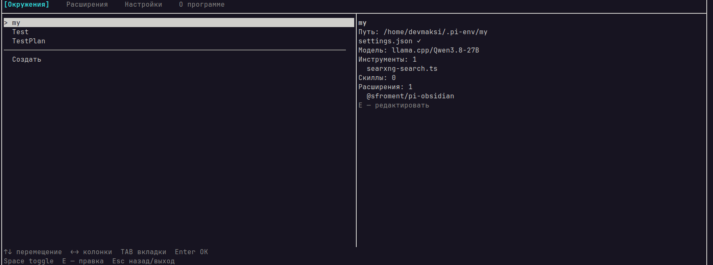

# pi-env

[English](README.en.md) | [Русский](README.md)

## 1. Overview

`pi-env` is an interactive TUI utility for managing environments of the AI agent `pi`.

A `pi` environment is a separate folder with the agent configuration (similar to `~/.pi/agent`):
`settings.json`, `extensions/`, `skills/`, `agents/`, `themes/`. The agent reads
its configuration from the directory specified by the `PI_CODING_AGENT_DIR`
environment variable. `pi-env` lets you create, edit, and launch such
environments and manage extensions — without leaving the terminal.

## Screenshot



**Features:**

- list of environments (root directory `~/.pi-env`, overridable via the
  `--root <path>` flag or the `PI_ENV_ROOT` environment variable);
- tabs: **Environments | Extensions | Settings | About**;
- environment creation via a form: name, model, tools, extension packages,
  skills (catalog is taken from the main `pi` agent);
- launching an environment: a child `pi` process with
  `PI_CODING_AGENT_DIR=<environment path>`, back to the TUI on exit;
- environment editing: change model, tools, packages, skills, rename,
  delete with confirmation;
- extension management: update checks («↑ latest» markers), updating
  one/all packages (`pi update`), removal (`pi remove`);
- installing extensions from the `https://pi.dev/packages` catalog: globally
  (the “Extensions” tab) and into a specific environment (“Install” button
  in the form);
- environment details: info panel of the selected one (model, tools, skills,
  extension packages);
- application settings: “Colored output”, “Recheck updates”
  (`npm outdated` on every visit to the “Extensions” tab); stored in
  `<root>/.pi-env.json` and survive restarts.

**Controls (main keys):**

| Key                      | Action                                                              |
| ---------------------------- | --------------------------------------------------------------------- |
| ↑/↓                          | move through the list                                                  |
| ←/→                          | column focus (wide mode, “Environments” tab)                    |
| TAB                          | switch tabs                                                  |
| Enter                        | confirm (launch environment, action on the selected item)         |
| Space                        | mark in creation lists / toggle in settings (color, recheck) |
| E                            | edit the selected environment                                     |
| X                            | remove the selected extension (with confirmation)                       |
| printable characters / Backspace | entering a name (creation form)                                           |
| ESC                          | back from a sub-screen / exit                                           |
| Ctrl+C                       | emergency exit                                                       |

## 2. Installation

**Requirements:** Node.js ≥ 20 and the `pi` CLI installed
(`npm install -g @earendil-works/pi-coding-agent`).

```bash
npm install -g /path/to/pi-env   # or: npm link in the source directory
pi-env                          # launch the TUI (environments root — ~/.pi-env)
pi-env --help                   # help
pi-env myenv --mode json "Review this repository"   # run pi in the environment (args passed as-is)
```

All installation methods (including Node.js setup), removal, and notes
(TTY, Windows) — in [docs/installation.en.md](docs/installation.en.md).

## 3. Documentation

- [Installation](docs/installation.en.md) — Node.js, pi-env install/remove
- [Development](docs/development.en.md) — stack, quick start, project structure,
  conventions
- [AGENTS.md](AGENTS.md) — environments model, current status, roadmap
